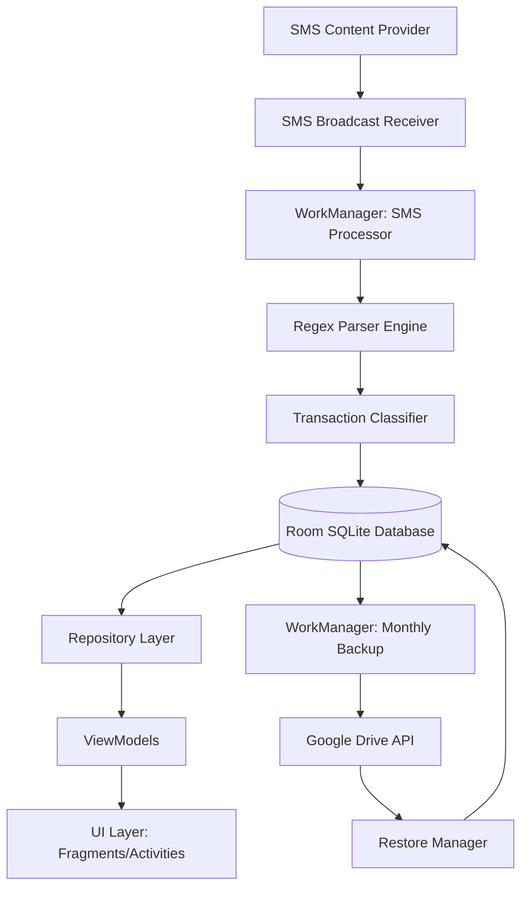

# Expense Tracker - Complete Implementation Guide

## 1. System Architecture

The application follows a clean MVVM (Model-View-ViewModel) architecture tailored for offline-first capabilities.



---

## 2. Database Schema Design

The local structure uses **Room**. Here is the entity structure representation:

*   **`Transaction` Table**
    *   `id` (int, Primary Key, Auto-increment)
    *   `amount` (double)
    *   `type` (String: "DEBIT", "CREDIT")
    *   `date` (long, Unix Timestamp)
    *   `merchantName` (String, nullable)
    *   `paymentMethod` (String: "UPI", "CARD", "NETBANKING")
    *   `referenceId` (String, nullable)
    *   `categoryId` (int, Foreign Key to Category)
    *   `contactId` (int, nullable, Foreign Key to ContactLedger)
    *   *Index:* `(date, amount, merchantName)` unique constraint to prevent duplicates.

*   **`Category` Table**
    *   `id` (int, Primary Key)
    *   `name` (String, e.g., "Food", "Travel")
    *   `type` (String: "EXPENSE", "INCOME")
    *   `keywords` (String, comma-separated rules for auto-matching)

*   **`ContactLedger` Table**
    *   `id` (int, Primary Key)
    *   `name` (String)
    *   `phoneNumber` (String, nullable)
    *   `upiId` (String, nullable)
    *   `totalGiven` (double)
    *   `totalReceived` (double)

---

## 3. SMS Parsing Logic & Regex Patterns

**Regex Matchers for Indian Banks/Wallets:**

*   **Debit:** `(?i)(?:Rs\.?|INR)\s*([\d,]+\.?\d*)\s*(?:has been)?\s*debited\s*(?:from|a/c)`
*   **Credit:** `(?i)(?:Rs\.?|INR)\s*([\d,]+\.?\d*)\s*(?:has been)?\s*credited\s*(?:to|a/c)`
*   **Merchant/Recipient Capture:** `(?i)(?:vpa|info|at|to)\s+([A-Za-z0-9\s.@]+)(?:\s+on|\s+ref|\s+upi|\.)`
*   **Payment Method:** `(?i)(UPI|Card|Netbanking|NEFT|RTGS|IMPS)`
*   **Reference / TXN ID:** `(?i)(?:ref|upi ref|txn no|utr)[^\d]*(\d{10,14})`

**Deduplication Strategy:**
Generate a unique hash using `hash(Timestamp_to_Hour + Amount + RegexSubstring(Merchant))`. If an incoming SMS hash matches an existing transaction, ignore it.

---

## 4. Transaction Classification Logic

Classification uses heuristics based on extracted text:

1.  **Income:** If SMS matches the "Credit" regex AND contains keywords `["salary", "refund", "reversal"]`.
2.  **Expense:** If SMS matches "Debit" regex AND the merchant isn't mapped to a known contact.
3.  **Transfer (Loan/Repay):** If SMS contains keywords `["sent to", "received from", "transferred to"]` or matches a known UPI ID from the `ContactLedger`.
4.  **Category Mapping:** Intersect the extracted merchant string with the `keywords` column of the `Category` table (e.g., if matched merchant is "Swiggy", map to "Food").

---

## 5. Contact Mapping Logic

When parsing identifies a person (e.g., user sent money to a VPA `friend@upi`):
1. Query `ContactsContract.CommonDataKinds.Phone` using content resolvers.
2. If the parsed name/UPI reasonably matches a contact name, link it.
3. Update `ContactLedger`.
    * If Debit: `balance -= amount`, `totalGiven += amount`.
    * If Credit: `balance += amount`, `totalReceived += amount`.

---

## 6. WorkManager Setup

1.  **`SmsProcessWorker` (One-Time):** Triggered by `BroadcastReceiver` to parse incoming SMS off the main thread.
2.  **`SmsSyncWorker` (Periodic):** Runs once every 24 hours to scan the device inbox for any missed SMS (e.g., phone was off, app was killed).
3.  **`DriveBackupWorker` (Periodic):** Configured with `PeriodicWorkRequest` running every 30 days.
    *   *Constraints:* `NetworkType.CONNECTED`, `setRequiresBatteryNotLow(true)`.

---

## 7. Google Drive Integration Steps

1.  Go to **Google Cloud Console**, create a project, and enable the **Google Drive API**.
2.  Configure the **OAuth Consent Screen** (add scope: `https://www.googleapis.com/auth/drive.file`).
3.  Create an Android OAuth Client ID using your app's package name and SHA-1 certificate fingerprint.
4.  Add dependencies: `play-services-auth`, `google-api-client-android`, `google-api-services-drive`.

---

## 8. Backup & Restore Implementation

**Backup Flow:**
1.  Authenticate using `GoogleSignIn.getLastSignedInAccount(context)`.
2.  Query all Room tables and serialize the data into a single JSON string using `Gson`.
3.  Upload logic creates a file named `backup_{YYYY_MM}.json`. Look for the specific "ExpenseTrackerBackup" folder; if not found, create it via the API.

**Restore Flow:**
1.  Fetch the list of backups from the app's Drive folder.
2.  Download the selected JSON payload using `Drive.Files.Get`.
3.  Parse JSON into objects and perform batch generic inserts into Room, utilizing `OnConflictStrategy.IGNORE` to safely merge old DB instances.

---

## 9. Sample Java Code

### 1. SMS Reading (Broadcast Receiver)
```java
public class SmsReceiver extends BroadcastReceiver {
    @Override
    public void onReceive(Context context, Intent intent) {
        if (Telephony.Sms.Intents.SMS_RECEIVED_ACTION.equals(intent.getAction())) {
            SmsMessage[] messages = Telephony.Sms.Intents.getMessagesFromIntent(intent);
            for (SmsMessage sms : messages) {
                String body = sms.getDisplayMessageBody();
                String sender = sms.getDisplayOriginatingAddress();
                
                // Offload heavy RegEx parsing to WorkManager
                Data inputData = new Data.Builder()
                        .putString("BODY", body)
                        .putString("SENDER", sender)
                        .build();
                        
                OneTimeWorkRequest workRequest = new OneTimeWorkRequest.Builder(SmsProcessWorker.class)
                        .setInputData(inputData)
                        .build();
                        
                WorkManager.getInstance(context).enqueue(workRequest);
            }
        }
    }
}
```

### 2. Regex Parsing Logic
```java
public class SmsParser {
    public static ParsedData parseTransaction(String smsBody) {
        Pattern debitPattern = Pattern.compile("(?i)(?:Rs\\.?|INR)\\s*([\\d,]+\\.?\\d*)\\s*(?:has been)?\\s*debited");
        Matcher matcher = debitPattern.matcher(smsBody);
        
        if (matcher.find()) {
            String amountStr = matcher.group(1).replace(",", "");
            double amount = 0.0;
            try {
                amount = Double.parseDouble(amountStr);
            } catch (NumberFormatException e) {
                // handle error
            }
            
            return new ParsedData(
                amount,
                TransactionType.DEBIT,
                extractMerchant(smsBody)
            );
        }
        return null; // Not a transaction SMS
    }
    
    private static String extractMerchant(String body) {
        // extraction logic ...
        return "Unknown";
    }
}
```

### 3. Room Database DAO
```java
@Dao
public interface TransactionDao {
    @Insert(onConflict = OnConflictStrategy.IGNORE) // Deduplication by index
    ListenableFuture<Long> insertTransaction(Transaction transaction);

    @Query("SELECT SUM(amount) FROM transactions WHERE type = 'DEBIT' AND date BETWEEN :start AND :end")
    LiveData<Double> getMonthlyExpense(long start, long end);
}
```

### 4. Google Drive Upload (Worker Snippet)
```java
public String uploadBackupToDrive(Drive driveService, String jsonPayload) {
    try {
        com.google.api.services.drive.model.File fileMetadata = new com.google.api.services.drive.model.File();
        fileMetadata.setName("ExpenseTracker_Backup_" + System.currentTimeMillis() + ".json");
        fileMetadata.setMimeType("application/json");
        
        ByteArrayInputStream contentStream = new ByteArrayInputStream(jsonPayload.getBytes(StandardCharsets.UTF_8));
        InputStreamContent mediaContent = new InputStreamContent("application/json", contentStream);
        
        com.google.api.services.drive.model.File file = driveService.files().create(fileMetadata, mediaContent)
            .setFields("id")
            .execute();
            
        return file.getId(); // success
    } catch (Exception e) {
        e.printStackTrace();
        return null; // Handle failure, WorkManager will re-try
    }
}
```

---

## 10. UI Structure

Developed using **XML Layouts** and View Binding with Navigation Component.

*   **Dashboard:** Summary cards (Total Income, Total Expense, Net Savings), current month progress bar, categorical chart, recent transactions list.
*   **Transactions List:** Scrollable list grouped by Date. Integrated search bar and category filters.
*   **Category/Analytics View:** Detailed Bar charts grouped by weeks/categories.
*   **Contact Ledger:** Alphabetical list of contacts displaying pending +/- balances.
*   **Settings/Sync:** Google Account picker, Manual Backup/Restore buttons, timestamp of last sync.

---

## 11. Edge Cases Handling

*   **Wrong Classifications:** Give user the ability to long-press any transaction and "Re-categorize". The app should learn from this override and update the `Category` keywords.
*   **Same Transaction Message Repeated:** Banks occasionally send out duplicate SMS due to network latency. The Room entity unique indices (`date` + `amount`) will quietly ignore the duplication in the database.
*   **Bank SMS Format Changes:** Move the core logic for Regex patterns to a local JSON file that can be updated via a silent network fetch, preventing the need to release a full APK update if HDFC/SBI changes their text structure.

---

## 12. Performance Optimizations

*   **Paging 3** is highly recommended for the Transactions view, ensuring that loading years of transactions consumes static RAM sizes instead of causing `OutOfMemoryError`.
*   **LiveData / RxJava:** Observe the database using `LiveData` or RxJava. UI is only re-drawn when an actual insert occurs.
*   **Batch Contact Searching:** Do not query device contacts one-by-one inside a heavy loop. Either index contacts into a local HashMap on startup or query them only upon viewing the Ledger.

---

## 13. Security Considerations

*   **No Backend Extrusion:** All regex parsing is local. No data should be sent to analytics services or developer servers.
*   **Database Encryption:** Wrap Room with **SQLCipher** using a keystore-backed key to encrypt user financials at rest.
*   **Drive Perms Constraint:** Use `drive.file` scope instead of `drive.readonly`. This restricted scope gives the application permission to ONLY read and write files it created, protecting user privacy.

---

## 14. Build & Deployment Requirements

**Step-by-Step for Execution:**
1.  **Clone / Prepare:** Open Android Studio -> New Project -> "Empty Views Activity" (Java).
2.  **Dependencies:** Ensure `/build.gradle` has Room, WorkManager, Guava (for ListenableFuture), and Google Auth dependencies integrated.
3.  **Permissions in AndroidManifest.xml:** 
    *   `<uses-permission android:name="android.permission.RECEIVE_SMS" />`
    *   `<uses-permission android:name="android.permission.READ_SMS" />`
    *   `<uses-permission android:name="android.permission.INTERNET" />`
4.  **Run locally:** Connect your Android physical phone via USB (Developer Options -> USB Debugging enabled). Click **Run (Shift+F10)**.
5.  **Build Release APK:**
    *   `Build > Generate Signed Bundle / APK > APK`.
    *   Create a Keystore file (e.g., `keystore.jks`). Store alias and passwords securely.
    *   Select `release` build variant and check `.apk` generation.
6.  **Installation:** Extract the resulting `app-release.apk` to your phone directly and enable "Install from Unknown Sources" to deploy the production build.
